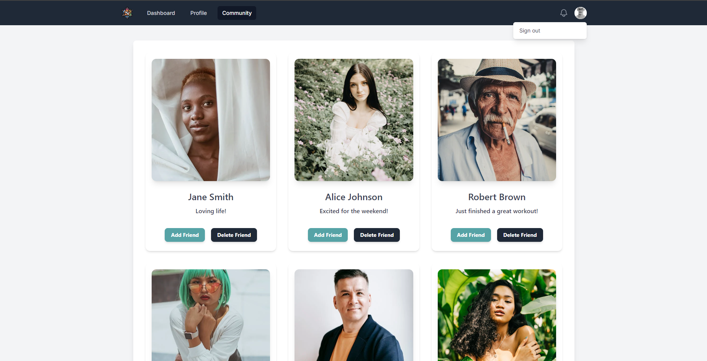

# Social Network Web Application

## Description

A social networking platform allowing users to connect, post updates, and interact. Features include user authentication, profile customization, friend management, and posting status updates. Built with TypeScript, NextJs, Redux, and Tailwind CSS, and deployed on Vercel.

## Features

- **User Authentication** : login/logout .
- **Profile Management** : Users can update their profile and profile pictures.
- **Social Interactions** : Add friends, create posts, and comment/like others' posts.
- **State Management** : Managed via Redux.
- **Responsive Design** : Built with Tailwind CSS.

## Project Structure

- **Public** : Contains static assets such as images (e.g., `meeting.png`, `profile.png`).
- **Src** :
- **app/components** : Contains UI components (`Dashboard.tsx`, `StatusForm.tsx`, etc.).
- **redux** : Redux store and reducers for state management.
- **interfaces** : TypeScript interfaces.

## Technologies Used

- **Frontend** : React, TypeScript
- **State Management** : Redux
- **Styling** : Tailwind CSS
- **Build & Deployment** : Next.js, Vercel

## Deployment

The project is live and accessible via the following link:

[Social Network App Deployment](https://social-network-ms.vercel.app)

